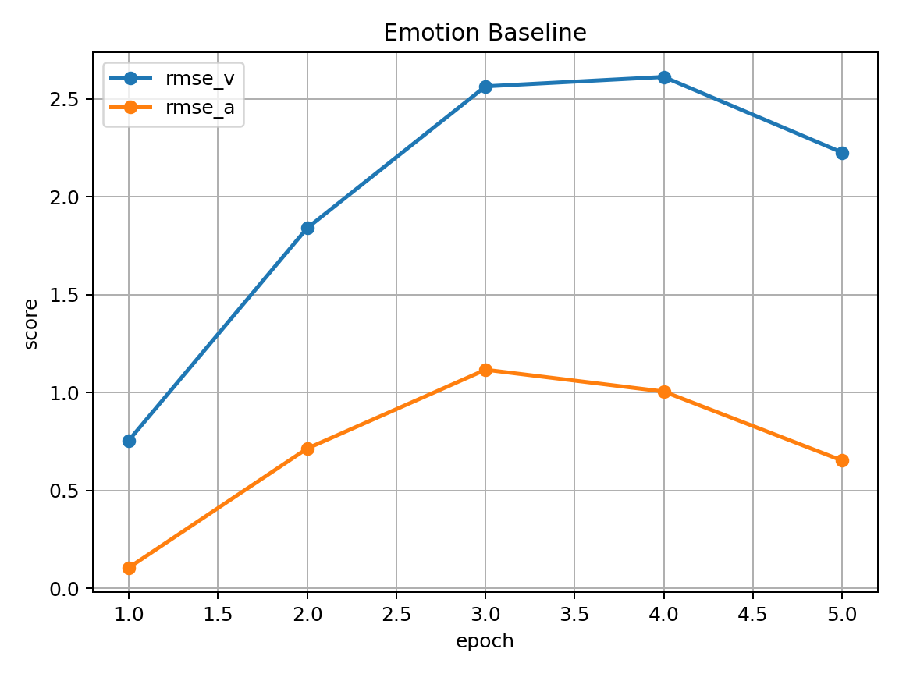

\## Multi-Task Learning with Late-Fusion Features for Music Genre \& Emotion

\*\*Repo:\*\* https://github.com/Khua0419/music-multitask-genre-emotion


\*\*What this stage delivers:\*\* a reproducible pipeline to test whether a simple multi-task model (shared backbone + two heads) helps both genre classification and emotion (valence/arousal) regression, with late fusion of Mel/MFCC/Chroma.


\*\*What we have so far\*\*

\- Data pipeline for Mel/MFCC/Chroma and a unified dataset format.

\- PyTorch model: shared 2D CNN backbone + genre (softmax) + emotion (regression).

\- Training script with multi-task loss and basic metrics (Accuracy/Macro-F1, RMSE).

\- A tiny “smoke test” to verify the end-to-end pipeline runs.


\*\*How to run (smoke test)\*\*

```bash

conda create -n mtl-audio python=3.10 -y

conda activate mtl-audio

pip install -r requirements.txt

python scripts/make\_tiny\_dummy.py

python -m experiments.train\_multitask --cfg experiments/configs/mtl\_deam\_gtzan.json
### Preliminary results (smoke test)
#### More smoke tests

- **Emotion-only baseline (RMSE, dummy DEAM):**
[Emotion|Epoch 1] rmse(V)=0.412 rmse(A)=0.097
[Emotion|Epoch 2] rmse(V)=0.786 rmse(A)=0.147
[Emotion|Epoch 3] rmse(V)=1.086 rmse(A)=0.212

- **Multi-task (GTZAN + DEAM, alternating batches):**
[MTL|Epoch 1] acc=0.000 f1=0.000 rmse(V)=0.108 rmse(A)=0.666
[MTL|Epoch 2] acc=0.000 f1=0.000 rmse(V)=0.013 rmse(A)=0.598
[MTL|Epoch 3] acc=0.000 f1=0.000 rmse(V)=0.080 rmse(A)=0.526

_(Numbers are from tiny dummy data, just to verify the pipeline. We'll replace them with real GTZAN/DEAM results next.)_

We verified the end-to-end pipeline using 3 tiny dummy clips arranged as GTZAN-like folders.

- **Genre-only baseline:** ran for 3 epochs with a tiny batch; logs looked like:

[Genre|Epoch 1] acc=0.000 f1=0.000
[Genre|Epoch 2] acc=0.000 f1=0.000
[Genre|Epoch 3] acc=0.000 f1=0.000
```
These numbers are expected for a 3-sample toy set; the goal of this step is just to confirm the data → features → training → evaluation loop works before switching to real datasets (GTZAN/DEAM).
```
### Preliminary results — plots

**Genre-only baseline**  
Acc/F1 learning curve  


Confusion matrix  


**Emotion-only baseline**  
RMSE (valence/arousal) learning curve  


**Multi-task (GTZAN + DEAM, alternating batches)**  
Acc/F1/RMSE combined curves  


