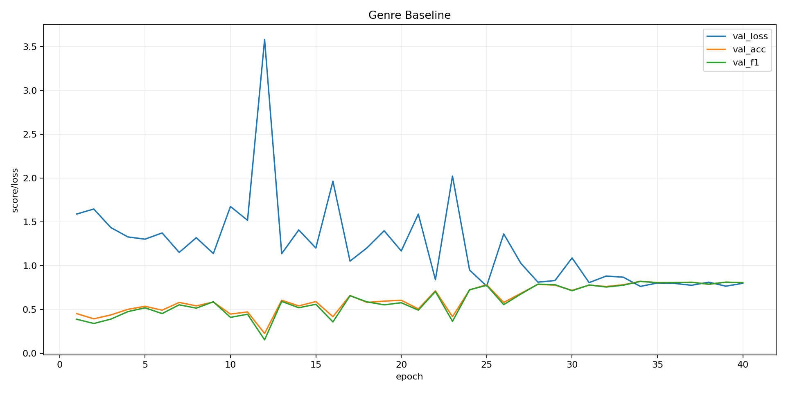
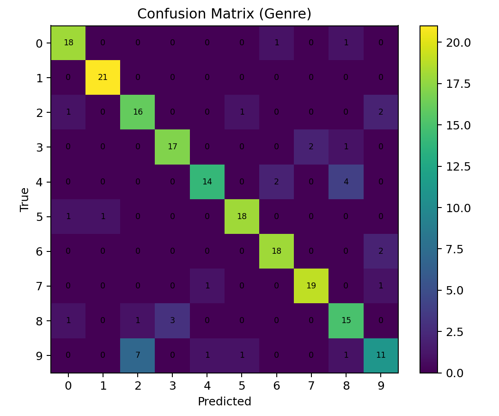

# 🎵 Multi-Task Learning
### Late-Fusion Features for Music Genre & Emotion

**Repo:** [https://github.com/Khua0419/music-multitask-genre-emotion](https://github.com/Khua0419/music-multitask-genre-emotion)

This stage documents the **GTZAN genre baseline** (real 80/20 split).  
We provide: data preparation, training, validation plots, and a single-file inference demo.

---

## 🧩 Environment

```bash
conda create -n mtl-audio python=3.10 -y
conda activate mtl-audio
pip install -r requirements.txt
```
Data and checkpoints are git-ignored (data/**, experiments/checkpoints/**).

## 🎧 Data (GTZAN)

Folder structure:
```bash
data/GTZAN_raw/<genre>/<file>.wav
```

## Generate stratified 80/20 train/val lists:
```bash
python scripts/make_full_splits_balanced.py
# creates:
#   data/lists/gtzan_train.json
#   data/lists/gtzan_val.json
```
## 🚀 Train (Genre Baseline)
```bash
python -m experiments.train_genre_only
```

Outputs (after training):
```bash
Logs: experiments/logs/genre_curve.csv

Confusion-matrix CSV: experiments/logs/genre_confmat.csv

Curves PNG: experiments/logs/genre_curve.png

Confmat PNG: experiments/logs/genre_confmat.png

Checkpoints: experiments/checkpoints/genre_last.pt (and optionally genre_best_eXX.pt)
```

## 📊 Validation Plots

### Acc/F1 Learning Curve (validation)


### Confusion Matrix (validation)


## 🎼 Single-file Inference (Top-k)

```bash
python -m scripts.predict_genre "data/GTZAN_raw/jazz/jazz.00000.wav" 5
```
Sample output:
```bash
Top-5 for data/GTZAN_raw/jazz/jazz.00000.wav:
  classical  p=0.835
  jazz       p=0.069
  country    p=0.050
  blues      p=0.030
  reggae     p=0.008
```
