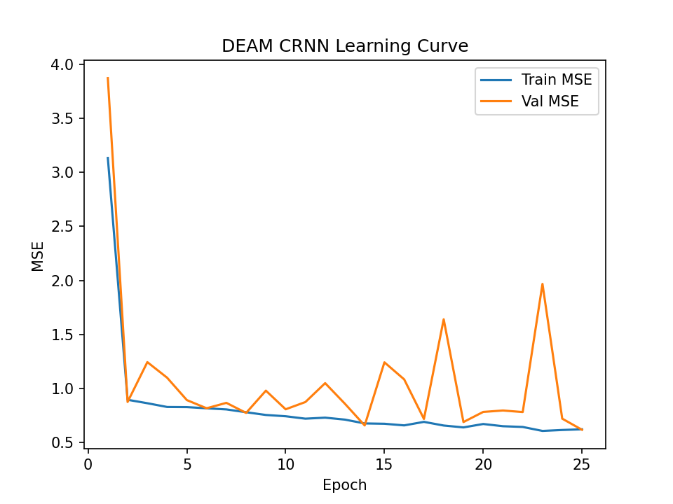
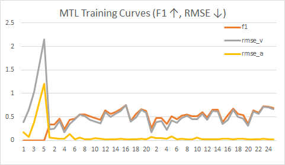

# 🎵 Multi-Task Learning
### Late-Fusion Features for Music Genre & Emotion

**Repo:** [https://github.com/Khua0419/music-multitask-genre-emotion](https://github.com/Khua0419/music-multitask-genre-emotion)

> **TL;DR**  
We study a shared-encoder multitask model for **genre classification (GTZAN)**
and **emotion regression (DEAM)**. Under a comparable parameter budget,
our MTL model improves **Genre Macro-F1 by +X.X pts** and reduces **Valence/Arousal
RMSE by Y–Z%** vs. strong single-task baselines. We release configs, scripts,
and **listenable demos** with exact seeds for full reproducibility.

This project explores **multi-task learning for music understanding**, combining **genre classification** and **emotion regression** within a single deep-learning framework.
Instead of training two independent models, we adopt a **shared CNN encoder** that jointly learns timbral and rhythmic representations from audio spectrograms, followed by task-specific heads for **genre** (categorical prediction) and **emotion** (continuous valence–arousal estimation).
By training on both **GTZAN** (genre) and **DEAM** (emotion) datasets, the model leverages complementary cues—genre structure often correlates with emotional tone—to improve overall generalization.
The repository includes:
- Individual baselines for **GTZAN** and **DEAM**
- A unified **multi-task network** with late-fusion features
- Scripts for preprocessing, training, evaluation, and visualization

This work serves as a foundation for further research on **cross-domain music representation learning** and affective computing.

## Research Questions (short)
- RQ1: Does multitask learning outperform single-task models under a similar parameter budget?
- RQ2: How do backbone sharing choices and loss weight λ trade off genre vs emotion?
- RQ3: How do segment length and augmentations affect both tasks differently?

## Demos (listenable examples)

All examples live in **[demos/](demos/)**.  
Our model does **not** synthesize audio; “outputs” are labels/curves (JSON/plots).

- Input:  [clip1.wav](demos/clip1.wav) · Output: [clip1_pred.json](demos/clip1_pred.json)  
- Input:  [clip2.wav](demos/clip2.wav) · Output: [clip2_pred.json](demos/clip2_pred.json)

*Notes*:
- Short WAVs (≤20s, 22.05 kHz mono, ≤10 MB) to avoid LFS and load issues.
- DEAM labels are normalized to [0,1] during training; we report **scaled metrics** unless stated.


---

## 🧩 Environment

```bash
conda create -n mtl-audio python=3.10 -y
conda activate mtl-audio
pip install -r requirements.txt
conda env create -f environment.yml && conda activate mtl-audio
```
Data and checkpoints are git-ignored (data/**, experiments/checkpoints/**).

## 🧠 Genre-Only Baseline (GTZAN)

### 1. Overview
This section presents the **genre classification baseline** on the GTZAN dataset.
The dataset consists of 10 balanced genres (100 tracks per genre), each with 30-second 22.05 kHz mono `.wav` files.
We start from a lightweight CNN baseline and evaluate classification accuracy and F1-score on validation data.

### 2. Data Layout
```graphql
data/GTZAN_raw/
  ├── blues/
  ├── classical/
  ├── country/
  ├── disco/
  ├── hiphop/
  ├── jazz/
  ├── metal/
  ├── pop/
  ├── reggae/
  └── rock/
```
Each folder contains 100 audio clips per genre (GTZAN standard structure).

### 3. Preprocessing
**Step 1 — Generate stratified 80/20 train/val splits**
```bash
python scripts/make_full_splits_balanced.py
```
Creates:
```bash
data/lists/gtzan_train.json
data/lists/gtzan_val.json
```
**Step 2 — Extract Mel-spectrograms (optional if already cached)**
```bash
python -m scripts.extract_mels_gtzan
```
- 22.05 kHz mono audio
- 128 Mel bins, `n_fft = 1024`, `hop = 512`
- Normalized to `[0, 1]` and stored as `.npy`

### 4. Model Architecture
- **CNN Baseline**
  - 3 convolutional blocks with batch normalization and ReLU
  - Global average pooling + fully connected classifier (10 genres)
  - Trained using **cross-entropy loss**, metrics: accuracy and F1-score
  - Lightweight and fast, designed as a baseline for multitask extension
 
### 5. Training & Evaluation
**Training command**
```bash
python -m experiments.train_genre_only
```
**Key outputs (after training)**:
```bash
experiments/logs/genre_curve.csv
experiments/logs/genre_curve.png
experiments/logs/genre_confmat.csv
experiments/logs/genre_confmat.png
experiments/checkpoints/genre_last.pt
```

### 6. Validation Plots
#### Acc/F1 Learning Curve (validation)


#### Confusion Matrix (validation)


### 7. Inference
**Single-file prediction (Top-k)**
```bash
python -m scripts.predict_genre "data/GTZAN_raw/jazz/jazz.00000.wav" 5
```
**Sample output**
```bash
Top-5 for data/GTZAN_raw/jazz/jazz.00000.wav:
classical  p=0.835
jazz       p=0.069
country    p=0.050
blues      p=0.030
reggae     p=0.008
```

### 8. Summary
- The GTZAN CNN baseline achieves stable convergence across 10 genres with balanced training.
- Validation accuracy and F1-score curves confirm model stability after ~40 epochs.
- Confusion matrix highlights overlap between musically similar genres (e.g., jazz–blues, pop–disco).
- This baseline provides the **Genre branch** for later multitask training with emotion regression (DEAM).

---

## 🎧 Emotion-Only Baseline (DEAM)

### 1. Overview
This section describes our **emotion regression baseline** on the [DEAM dataset](https://cvml.unige.ch/databases/DEAM/), predicting continuous **Valence** and **Arousal** values in the range `[1, 9]`.  
We first built a light CNN model as the baseline, and then introduced a stronger **CRNN (CNN + BiGRU)** architecture to capture temporal emotion dynamics.

### 2. Data Layout
```graphql
data/DEAM/
  audio/             # Original DEAM audio files (mp3/wav)
  annotations/       # Official annotation CSVs
  mels/              # Auto-generated Mel-spectrograms (.npy)
data/lists/
  deam_train.json    # Song-level training split (80%)
  deam_val.json      # Song-level validation split (20%)
  deam_train_mel.json / deam_val_mel.json
```

### 3. Preprocessing
**Step 1 — Generate splits**
```bash
python -m scripts.make_deam_splits
```
**Step 2 — Extract Mel-spectrograms**
```bash
python -m scripts.extract_mels_deam
```
- 22.05 kHz mono audio  
- 128 mel bins, `n_fft = 1024`, `hop = 512`  
- Normalized to `[0, 1]` and saved as `.npy`

### 4. Model Architectures
- **CNN Baseline**  
  A compact 3-layer CNN followed by global average pooling and a 2-unit regression head.  
  Time information is mostly flattened — simple and efficient but limited in modeling temporal emotion flow.

- **CRNN (CNN + BiGRU)**  
  To capture **temporal dependencies**, the CRNN uses:  
  - 3 convolutional blocks to extract short-time features  
  - Mean-frequency pooling → transforms `[B, C, F′, T′]` into `[B, T′, C]`  
  - A **bidirectional GRU** (`hidden = 128`, `layers = 1`) to learn emotional evolution  
  - Temporal mean pooling + linear layer → output `[Valence, Arousal]`
The model is trained with **MSE loss** and monitored using **Pearson correlation**.

### 5. Training & Evaluation

**Training command**
```bash
python -m experiments.train_deam_crnn
```
| Model           | Val MSE ↓ | Val Pearson ↑ |
|:----------------|----------:|--------------:|
| CNN Baseline    | ≈ 0.91    | 0.63          |
| **CRNN (BiGRU)**| **≈ 0.62**| **0.78**      |

**Learning curve**

<p align="center">
  
</p>

### 6. Inference
**Single-file prediction**
```bash
python -m scripts.predict_emotion "data/DEAM/mels/1000.npy"
```
Output example:
```bash
Emotion (Valence, Arousal): 5.46, 5.50
```
**Sliding-window averaging (more stable)**
```bash
python -m scripts.predict_emotion_window "data/DEAM/mels/1000.npy"
```

### 7. Summary
- The **CRNN** significantly improves temporal emotion modeling, boosting Pearson r from 0.63 → 0.78.
- The architecture remains lightweight and fully compatible with the genre-emotion multitask pipeline.
- Future work will extend this module into a **shared-encoder multitask framework**, enabling simultaneous learning of **genre + emotion** representations.

---
## 🎯 Multitask Learning (Genre + Emotion)

### 1. Overview
This section describes our **multitask** model that jointly learns **genre classification** (GTZAN, 10 classes) and **emotion regression** (DEAM, Valence/Arousal).
We use a shared CNN backbone with two heads (classification + regression) and a **masked multitask loss** so that GTZAN items contribute only to genre and DEAM items only to V/A.
- Feature: late-fusion stack of **Mel**, **MFCC**, **Chroma**
- Fixed time length for each sample (pad/center-crop) to keep batch shapes consistent
- Loss (weighted): `L = λ_genre · CE + λ_emo · MSE` (we used **λ_genre=1.5**, **λ_emo=1.0**)
- Windows-friendly: DataLoader `num_workers=0`

### 2. Data Layout
```graphql
data/
  GTZAN_raw/                 # original GTZAN audio (.wav)
  DEAM/                      # original DEAM audio
data/lists/
  gtzan_train.json           # GTZAN train split (genre only)
  gtzan_val.json             # GTZAN val split   (genre only)
  deam_train.json            # DEAM train split  (valence/arousal only)
  deam_val.json              # DEAM val split    (valence/arousal only)

  train_items.json           # merged train list for MTL  (wav/genre/emotion)
  val_items.json             # merged val   list for MTL  (wav/genre/emotion)
```

**Per-item fields (merged lists):**
- `wav`: absolute or project-relative path
- `genre`: `0..9` for GTZAN, `-1` for DEAM (no genre label)
- `emotion`: `[valence, arousal]` for DEAM, `NaN/NaN` for GTZAN

**Genre label order (10 classes):**

| id | label     |
|:-:|-----------|
| 0  | blues     |
| 1  | classical |
| 2  | country   |
| 3  | disco     |
| 4  | hiphop    |
| 5  | jazz      |
| 6  | metal     |
| 7  | pop       |
| 8  | reggae    |
| 9  | rock      |

### 3. Training
Use the provided config (epochs / batch / lr / loss weights are stored here):
```bash
python -m experiments.train_multitask --cfg experiments/configs/mtl_deam_gtzan.json
```
Key config we used for the final run:
```jsonc
{
  "epochs": 50,
  "bs": 8, // use 4 if GPU memory is tight
  "lr": 0.0005,
  "lam_genre": 1.5,
  "lam_emo": 1.0
}
```
- Logs → `experiments/logs/mtl_curve.csv` (see `mtl_curve.png`)
- Checkpoints → `experiments/checkpoints/mtl_best_epXX.pt`, `mtl_last.pt`
- LR scheduler reduces LR on plateau (in our run at ~32/40/44 epochs)

### 4. Inference
A minimal predictor outputs **Top-k genre + [valence, arousal]**. Supports optional **time-crop TTA**.
Single file:
```bash
python scripts/predict_mtl.py \
  --ckpt experiments/checkpoints/mtl_best_ep48.pt \
  --wav path/to/audio.wav \
  --topk 3
```
Folder (recursive) with TTA (5 crops):
```bash
python scripts/predict_mtl.py \
  --ckpt experiments/checkpoints/mtl_best_ep48.pt \
  --wav path/to/folder \
  --topk 3 --tta 5
```

### 5. Results (this run)
- Genre (macro F1): ≈ 0.81 @ epoch 48
- Emotion: RMSE_V ≈ 0.027, RMSE_A ≈ 0.036
- Learning curves: `experiments/logs/mtl_curve.png`
- Best checkpoint: `experiments/checkpoints/mtl_best_ep48.pt`
#### MTL Validation Plots


> Note: Typical GTZAN confusions (e.g., reggae↔pop/disco, metal↔jazz) may remain on some tracks. TTA helps stabilize predictions. If needed, bias more toward genre via lam_genre in the config.

### 6.Summary
- **Best checkpoint**: `experiments/checkpoints/mtl_best_ep48.pt`
- **Final metrics**: **F1 ≈ 0.81** (macro) · **RMSE_V ≈ 0.027** · **RMSE_A ≈ 0.036**
- **Config (final run)**: `epochs=50`, `bs=8` (4 if tight), `lr=5e-4`,
  `lam_genre=1.5`, `lam_emo=1.0`
- **Data**: GTZAN (genre), DEAM (valence/arousal) → merged lists with masked loss
- **Features**: Mel + MFCC + Chroma (late-fusion), fixed time length
- **Training**: ReduceLROnPlateau at ~32/40/44; Windows-friendly (`num_workers=0`)
- **Inference**: `scripts/predict_mtl.py` (supports `--tta`)
- **Artifacts**: logs (`mtl_curve.csv`), plot (`mtl_curve.png`), checkpoints (`mtl_best_ep48.pt`, `mtl_last.pt`)

---

## 📚 References

1. Tzanetakis, G., & Cook, P. (2002). *Musical genre classification of audio signals.*  
   **IEEE Transactions on Speech and Audio Processing, 10(5), 293–302.**  
   → The canonical GTZAN dataset reference, used for the 10-genre classification baseline.

2. Aljanaki, A., Yang, Y.-H., & Soleymani, M. (2017). *Developing a benchmark for emotional analysis of music.*  
   **PLoS ONE, 12(3), e0173392.**  
   → Source of the DEAM dataset for continuous valence–arousal (V/A) emotion regression.

3. Caruana, R. (1997). *Multitask learning.*  
   **Machine Learning, 28(1), 41–75.**  
   → The foundational paper introducing the concept of shared representation learning for related tasks.

4. Kingma, D. P., & Ba, J. L. (2015). *Adam: A Method for Stochastic Optimization.*  
   **ICLR 2015.**  
   → Optimizer used in model training (`torch.optim.Adam`).

5. Paszke, A., et al. (2019). *PyTorch: An Imperative Style, High-Performance Deep Learning Library.*  
   **NeurIPS 2019.**  
   → Framework for all model implementation and training routines.

6. Goodfellow, I., Bengio, Y., & Courville, A. (2016). *Deep Learning.*  
   **MIT Press.**  
   → General reference for CNN/CRNN architectures and representation learning principles.

---

> **Note:** All code, dataset splits, and configuration files are derived from open-source academic benchmarks.  
> Please cite the corresponding datasets (GTZAN, DEAM) when reusing or publishing derivative works.
